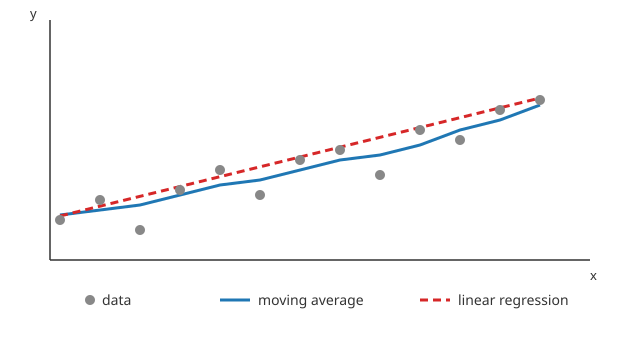

# ACS 4310 - Trend Lines

## Overview

Real data is noisy. A trend line cuts through that noise and shows the underlying direction — is this going up, down, or flat? Today you'll compute and draw trend lines over your own data with D3.

<!-- > -->

## Why you should know this

Your rubric asks for a chart that "tells a story that suggests ideas not apparent in the numbers alone." A scatter of noisy points rarely does that on its own — a trend line drawn through it often does. It's also one of the more common asks you'll get on the job: "can you add a trend line to this?"

<!-- > -->

## Learning Objectives

1. Explain what a trend line shows and why it's useful
1. Compute a moving average over a series
1. Compute a linear regression (line of best fit) over a series
1. Draw a trend line over existing data with `d3.line()`

<!-- > -->

## What is a trend line?

A trend line is a single line drawn through (or near) a set of noisy data points to show their general tendency. It answers "ignoring the noise, which way is this headed?" You've seen these on stock charts, weather charts, anything plotted over time.



Two trend lines solve different problems:

- **Moving average** — smooths the data by averaging each point with its neighbors. Follows the data's shape closely, lags behind sudden changes, good for "smooth out the noise but keep the wiggles."
- **Linear regression** — fits the single straight line that best matches all the points. Ignores local wiggles entirely, good for "is this overall going up or down, and by how much?"

Neither is "more correct" — pick based on the question you're answering. "Is this generally trending up?" → regression. "What's the underlying pattern hiding under this noisy signal?" → moving average.

<!-- > -->

## Trend lines in the wild

These aren't classroom toy examples — they're charts people check regularly to understand the world right now:

- **[The Keeling Curve](https://keelingcurve.ucsd.edu/)** — daily atmospheric CO₂ at Mauna Loa since 1958. The raw data is a jagged, sawtooth line (CO₂ rises and falls with the seasons as plants grow and die back). Overlaid on it is a smoothed trend line that strips out the seasonal wiggle and shows the steady year-over-year rise. Two trend lines, two different stories, same dataset.
- **[NASA: Global Surface Temperature](https://science.nasa.gov/earth/explore/earth-indicators/global-temperature)** — annual global temperature is noisy (El Niño/La Niña years swing it around); NASA plots a 5-year running average — literally a moving average — on top so the long-term warming trend isn't lost in year-to-year noise.
- **[FRED: Unemployment Rate](https://fred.stlouisfed.org/series/UNRATE)** — the St. Louis Fed's own data explorer lets you add a trend line to any economic series (unemployment, CPI, GDP) it hosts — try it on a series you care about.

Notice the pattern: in every case, the raw data alone would either bury the story in noise or mislead you with a single unusual data point. The trend line is what turns "here's some numbers" into "here's what's actually happening."

<!-- > -->

## Moving average

A **simple moving average (SMA)** replaces each point with the average of itself and its `n` nearest neighbors ("a window").

```js
function movingAverage(data, windowSize, accessor) {
  return data.map((d, i, arr) => {
    const start = Math.max(0, i - windowSize + 1)
    const window = arr.slice(start, i + 1)
    return { x: d.x, y: d3.mean(window, accessor) }
  })
}

const smoothed = movingAverage(data, 5, d => d.y)
```

**ELI5:** imagine sliding a 5-day-wide window left to right across your data. At each stop, you average whatever's inside the window and that average becomes your new point. Noisy up-and-down days get flattened out because each one is now blended with its neighbors.

**New here — the extra `.map()` arguments:** you've used `.map(d => ...)` with just one argument. `.map()` actually always passes three: `(element, index, wholeArray)`. Here we need all three — `d` is the current point, `i` is its position (so we know how far back the window can reach), and `arr` is the full array (so we can `.slice()` a window out of it). `data.map((d, i, arr) => ...)` — same method, just using more of what it gives you.

**What's `accessor`?** It's just a function you pass in that says "given one data object, give me the number I care about" — e.g. `d => d.y`. `movingAverage` doesn't know or care whether your value is called `y`, `age`, or `fare`; you hand it the accessor and it calls `accessor(d)` wherever it needs that number. You've already been writing accessors like this for scales (`d => d.total`) — same idea, just passed around as a variable instead of written inline.

**What's `d3.mean()`?** A D3 helper that averages an array — `d3.mean(window, accessor)` calls `accessor` on every item in `window` and returns the average of the results. Same job as `window.reduce((sum, d) => sum + accessor(d), 0) / window.length`, just shorter. D3 has matching helpers for `d3.sum`, `d3.max`, `d3.min`, `d3.extent` — all take an array and an accessor.

Bigger window = smoother line, but more lag and more lost detail at the start of the series (there aren't `n` neighbors yet). Try a few window sizes on your own data and see what tells the clearest story.

<!-- > -->

## Linear regression

A **linear regression** finds the slope and intercept of the straight line that minimizes the distance to every point (least squares). You don't need a stats library for a simple case — it's a handful of sums:

```js
function linearRegression(data, xAccessor, yAccessor) {
  const xMean = d3.mean(data, xAccessor)
  const yMean = d3.mean(data, yAccessor)

  const slope = d3.sum(data, d => (xAccessor(d) - xMean) * (yAccessor(d) - yMean))
              / d3.sum(data, d => (xAccessor(d) - xMean) ** 2)

  const intercept = yMean - slope * xMean

  return { slope, intercept }
}

const { slope, intercept } = linearRegression(data, d => d.x, d => d.y)
```

**ELI5:** picture nudging a straight ruler around on top of your scatter plot until it's as close as possible to every point at once — not perfect for any one of them, but the best overall fit. That's what `slope` and `intercept` describe: how steep the ruler is, and where it crosses the y-axis. `y = slope * x + intercept` is the same `y = mx + b` you saw in algebra class.

**Two `xAccessor`/`yAccessor` this time:** same idea as `accessor` in the moving average — a function that pulls one number out of a data object — but now we need one for x *and* one for y, since regression compares both.

**What's `** 2`?** JavaScript's exponent operator — `x ** 2` means "x squared" (`x * x`). It shows up here because least-squares math squares the distances before summing them (so points above and below the line don't cancel each other out).

**What's `const { slope, intercept } = ...`?** Destructuring — `linearRegression` returns one object, `{ slope, intercept }`, and this line unpacks it straight into two separate variables instead of you writing `result.slope` and `result.intercept` everywhere. Same trick works on arrays with `[ ]`, which is what `const [x0, x1] = d3.extent(...)` is doing just below.

Once you have `slope`/`intercept`, you only need **two points** — the line's value at the start and end of your x domain — to draw it:

```js
const [x0, x1] = d3.extent(data, d => d.x)
const trendPoints = [
  { x: x0, y: slope * x0 + intercept },
  { x: x1, y: slope * x1 + intercept }
]
```

**Prefer not to hand-roll it?** [d3-regression](https://github.com/HarryStevens/d3-regression) adds `d3.regressionLinear()`, `regressionPoly()`, `regressionExp()`, and more — same idea, more curve shapes, one extra `<script>` tag.

<!-- > -->

## Drawing the trend line

Whichever method you used, you now have an array of `{x, y}` points. Reuse the **same `x`/`y` scales** as your main chart and draw it as its own `<path>` with `d3.line()`, styled so it reads as distinct from your data marks:

```js
const line = d3.line()
  .x(d => x(d.x))
  .y(d => y(d.y))

svg.append("path")
  .datum(trendPoints)      // or `smoothed` for a moving average
  .attr("d", line)
  .attr("fill", "none")
  .attr("stroke", "firebrick")
  .attr("stroke-width", 2)
  .attr("stroke-dasharray", "4 2")
```

Draw your trend line **after** your data marks so it layers on top, and give it a legend entry or label — a line with no explanation just looks like more noise.

<!-- > -->

## Lab

Using a numeric field from one of your own datasets (age, price, count over time, whatever fits):

1. Compute a moving average over it, with at least two different window sizes
1. Compute a linear regression over it
1. Draw both trend lines on top of your existing chart, styled distinctly from each other and from your data marks
1. In one sentence, say what story each trend line tells that the raw points alone don't

**Checkpoint:** you should be able to point at your chart and say "this is trending \_\_\_\_" — with a line, not just a guess.

<!-- > -->

## After this lesson

Apply a trend line to whichever of your [three visualizations](../Assignments/assignment-2.md) has a noisy numeric series — it's one of the fastest ways to move a chart from "meets" to "exceeds" on the Story row of the rubric.

## Additional Resources

**Live examples:**

- https://datavizproject.com/data-type/trendline/ — trendline as its own chart type: what it's for, when it's used
- https://www.data-to-viz.com/graph/line.html — line chart (what a trend line is usually drawn on top of), with pitfalls to avoid
- https://observablehq.com/@d3/moving-average — moving average, D3's own example
- https://observablehq.com/@hydrosquall/simple-linear-regression-scatterplot-with-d3 — regression line over a scatterplot
- https://observablehq.com/@harrystevens/introducing-d3-regression — tour of the d3-regression library (linear, polynomial, exponential, LOESS...)
- https://codepen.io/bloom-dan/pen/QGgbrX — line chart with a linear regression trend line, CodePen

**Reference:**

- https://github.com/HarryStevens/d3-regression
- https://d3indepth.com/shapes/#lines
- https://github.com/soggybag/d3-examples

<!-- > -->
